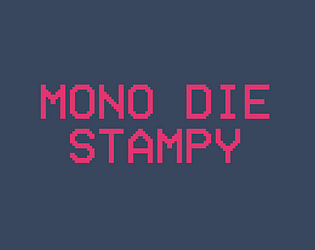
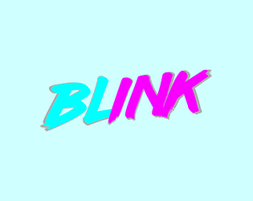

Games are fun, so naturally, I decided to spend some time not playing games and suffering through game dev instead.

If you're interested in game dev and like what you see, please reach out! I'm open to meeting collaborators. I probably have the most to offer as a programmer and designer, but I do have some experience with art and actively try to be well-rounded.

# Game Jams

## (2022) GMTK Game Jam

Theme: [Roll of the dice](https://itch.io/jam/gmtk-jam-2022)\
Submission: [Mono Die Stampy](https://protocolseven.itch.io/mono-die-stampy)\
Time limit: 48 hours

Roll a die around a grid and stamp the die face's pips onto the ground to draw a target pattern.\
It seems like I wasn't the only one to come up with this idea, but one of the other games using this concept made it into the [best of](https://www.youtube.com/watch?v=XNCGdi2A6fQ) video, so I don't feel too bad about that.\
The main challenge I anticipated was managing the time limit; I've done some timed competitions before, but this was the shortest so far. It ended up going very smoothly, and I even had the chance to flex some group theory along the way.

## (2020) Godot Wild Jam #25

Theme: [Change yourself, change the world](https://itch.io/jam/godot-wild-jam-25)\
Submission: [Blink](https://protocolseven.itch.io/blink)\
Time limit: 9 days

A bullet hell game where you can change colors to change the objects you interact with. You can only be hit by pink bullets if you're pink and blue if you're blue.\
This was my first jam, and really just a way to force myself to learn Godot. While working on this, a "friend" pointed out that [this game already exists](https://en.wikipedia.org/wiki/Ikaruga), which was a nice reminder that creativity and originality are fake and not real and soothing lies that we tell ourselves.

